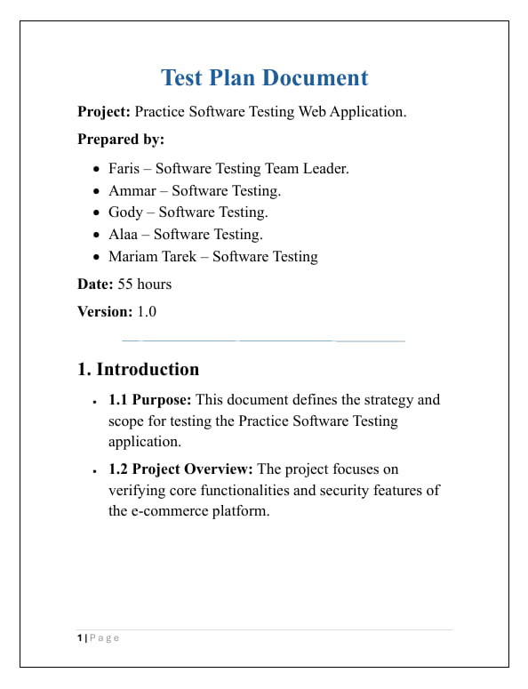
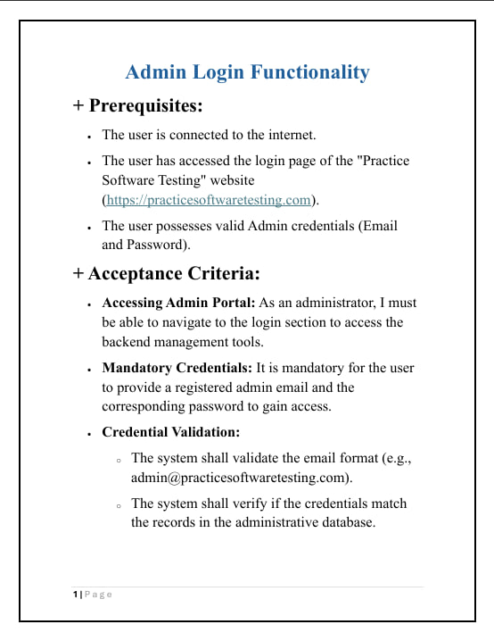
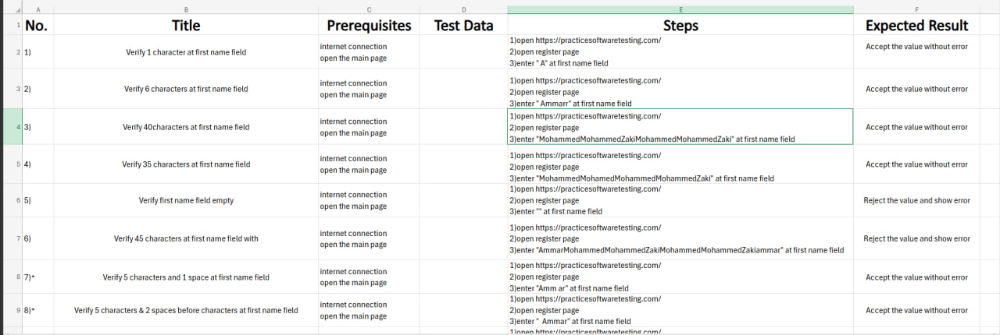
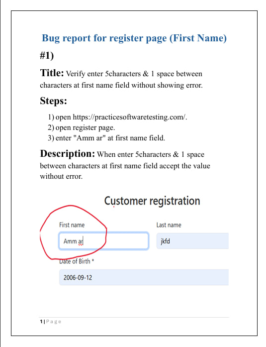
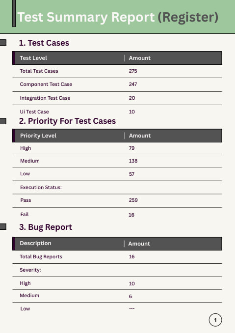
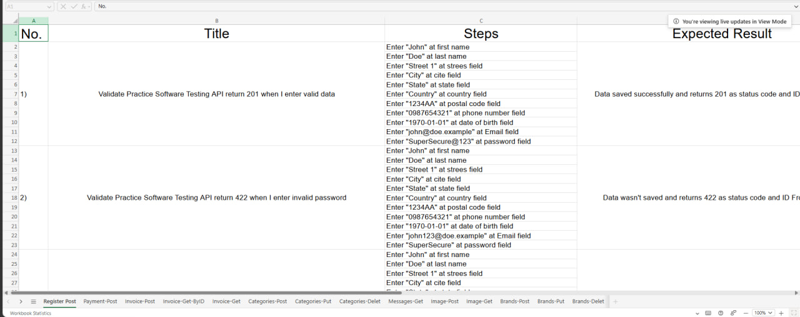
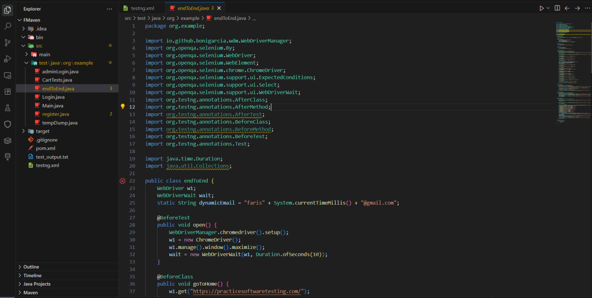
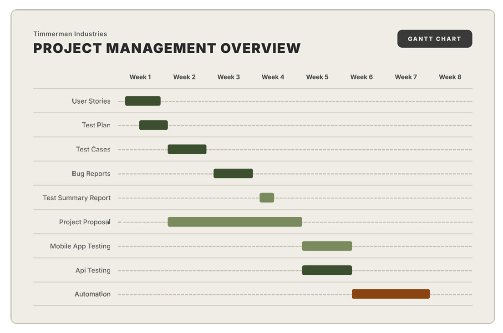
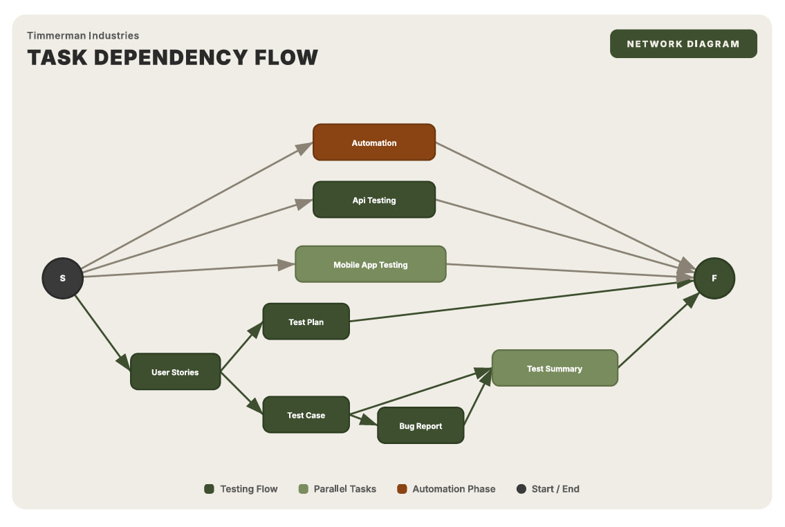

## 📌 Project Overview

Comprehensive Software Testing project conducted on the Practice Software Testing E-Commerce platform.

The project applies the complete Software Testing Life Cycle (STLC) to ensure software quality, reliability, security, and an excellent user experience across web and mobile platforms.

The testing process covered Manual Testing, API Testing, Mobile Testing, Security Testing, and Automation Testing using industry-standard tools and methodologies.

---

## 🎯 Project Objectives

- Ensure software quality and reliability.
- Deliver the best possible user experience.
- Identify and report defects before production release.
- Validate business requirements and user stories.
- Verify API functionality and data integrity.
- Improve application security through vulnerability testing.
- Automate critical business workflows.
- Ensure compatibility across multiple devices and operating systems.

---

## 💡 Problem Statement

E-Commerce systems contain many business-critical features such as authentication, product management, shopping carts, and payment processing. Any defect or security vulnerability can negatively affect users and business operations.

This project addresses these challenges by performing comprehensive testing activities to identify defects, improve user experience, validate functionality, and reduce security risks such as SQL Injection and unauthorized access.

---

## 🏪 System Under Test

### Practice Software Testing

🔗 https://practicesoftwaretesting.com/

**System Type:** E-Commerce Platform

### User Roles

- Customer
- Admin
- Brands / Sellers

---

## 📋 Features Tested

### Authentication

- Register
- Login
- Admin Login
- Forgot Password
- Locked Account
- Multi-Factor Authentication (MFA)

### Product Management

- Product Listing
- Product Details
- Category Management
- Product Filtering

### Customer Features

- Customer Profile
- Favorites
- Messages
- Invoices

### Shopping Features

- Shopping Cart
- Checkout
- Payment

### Discounts

- Combo Discount
- Geolocation Discount

### Administration

- Admin Dashboard

### Additional Features

- Contact Form
- Country Availability Check

---

## 🧪 Testing Types Performed

### Manual Testing

- Functional Testing
- UI Testing
- Component Testing
- Integration Testing
- Regression Testing
- Security Testing
- End-to-End Testing

### API Testing

Performed using Postman:

- GET Requests
- POST Requests
- PUT Requests
- DELETE Requests

Validation Included:

- Status Codes Validation
- Response Validation
- Authentication Testing
- Authorization Testing
- Input Validation
- Response Time Validation

### Mobile Testing

Platforms Tested:

- Android
- iOS

Activities:

- Functional Testing
- UI Testing
- Compatibility Testing
- Defect Reporting

### Automation Testing

Tools Used:

- Java
- Selenium WebDriver
- TestNG
- Maven
- Page Object Model (POM)
- Extent Reports

Automated Scenarios Included:

- Registration
- Login
- Shopping Cart
- Checkout
- End-to-End Workflows

---

## 🔒 Security Testing

Security testing was performed to verify the application's resistance against common vulnerabilities and attacks.

Security validation included:

- SQL Injection Testing
- Invalid Input Handling
- Authentication Validation
- Authorization Validation
- Session Management Verification

The goal was to ensure user data protection and prevent unauthorized access.

---

Additional modules were tested and documented in the complete Test Summary Reports.

---

## 💻 Testing Environment

### Devices

- HP ZBook 15 G5
- ASUS TUF Gaming A15
- HP EliteBook
- Lenovo ThinkPad T470s
- Tecno Camon 20
- Redmi 9
- Redmi Note 14
- iPhone 13

### Operating Systems

- Windows 11 Pro
- Windows 10
- Android
- iOS

---

## 📅 Project Management

### Planning Tools

- Gantt Chart (8 Weeks)
- Network Diagram

These artifacts were used to manage project timelines, dependencies, testing activities, and project milestones.

---

## 🚀 Tools & Technologies

### Testing Tools

- Selenium WebDriver
- Postman
- TestNG
- Maven
- Extent Reports

### Programming Languages

- Java

### Project Management

- Gantt Chart
- Network Diagram

### Version Control

- Git
- GitHub

---

## 📸 Project Screenshots

### Test Plan

### User Stories

### Test Cases

### Bug Reports

### Test Summary Report

### API Testing Using Postman

### Automation Testing Using Selenium

### Gantt Chart

### Network Diagram

---

## 👨‍💻 Team

This project was developed as part of the **Digital Egypt Pioneers Initiative (DEPI)** - Software Testing Track.

The project demonstrates practical experience in:

- Software Testing Life Cycle (STLC)
- Manual Testing
- API Testing
- Mobile Testing
- Automation Testing
- Security Testing
- Defect Management
- Test Documentation
- Quality Assurance Best Practices

---

## 📄 License

This project is intended for educational and training purposes only.
